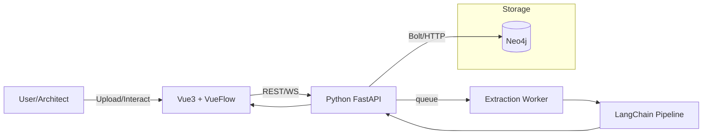

# PRD: Event-Storming → GraphDB(Neo4j) → VueFlow 프로토타입

## 1) 제품 목표 (Problem / Outcome)

* **문제:** RFP/업무 규정 등 자연어 문서에서 도메인 개념(어그리게이트/커맨드/이벤트/폴리시)을 수작업으로 뽑아 이벤트 스토밍 보드를 만드는 데 시간이 많이 듦. 추출물과 마이크로서비스 후보(경계/연결) 간 추적성도 부족.
* **목표:** 자연어 문서 → (LangGraph) → **Aggregate/Command/Event/Policy** 자동 후보 추출 → **Neo4j 그래프 스키마** 저장 → **VueFlow 캔버스**로 가시화/편집 → 편집 결과를 다시 Neo4j에 동기화.
* **핵심 성과지표(KPI):**

  * 초기 자동 추출의 **정밀도/재현율**(Aggregate 0.65/0.75, Event 0.7/0.7 목표)
  * 보드 생성 시간 **>60% 절감**
  * 추출 객체 ↔ 원문 근거(문장/페이지) **추적링크 100% 보존**

## 2) 사용자 및 주요 시나리오

* **사용자**:

  1. 도메인 아키텍트(주 사용자), 2) 분석가/PM, 3) 백엔드 아키텍트(DDD/EDA 설계)
* **핵심 시나리오**

  1. RFP PDF/Docx 업로드 → 자동 추출 → 초기 그래프/보드 생성
  2. 캔버스에서 노드/엣지 편집, 라벨/속성 수정, 근거문장 보기
  3. “마이크로서비스 후보 보기”로 Aggregate 군집/연관 이벤트 기반 추천
  4. 저장 시 Neo4j에 구조적 그래프/트레이스 업데이트

## 3) 범위 (MVP 스코프)

* **포함**

  * 문서 업로드(텍스트 추출), LangGraph 통한 어그리거트 후보 추출
  * Neo4j 스키마 정의 및 저장/조회 API
  * VueFlow 캔버스 노드/엣지 타입(AGG, CMD, EVT, POL) 편집
  * 원문 근거 하이라이트(문서 파편 id/offset 링크)
  * 단일 프로젝트 단일 보드
* **제외(후속)**

  * 다중 프로젝트 권한/공유, 버전 브랜치, DMN/DRL 자동 생성, 완전한 MS 경계 자동화

## 4) 도메인/그래프 스키마 설계

### 4.1 노드 라벨 & 속성

* **Aggregate**(`Aggregate`)

  * `id: UUID`, `name: string`, `description: string`, `source_refs: [Ref]`, `confidence: float`, `tags: [string]`
* **Command**(`Command`)

  * `id`, `name`, `intent: enum(Create/Update/Delete/Query/Custom)`, `preconditions: [text]`, `source_refs`, `confidence`
* **Event**(`Event`)

  * `id`, `name`, `schema_hint: json`, `source_refs`, `confidence`
* **Policy**(`Policy`)

  * `id`, `name`, `type: enum(ProcessPolicy/SagaPolicy/Rule)`, `condition: text`, `source_refs`, `confidence`
* **DocumentFragment**(`DocFrag`)

  * `id`, `doc_id`, `page: int`, `span: [start,end]`, `text`

> `source_refs`는 `[{docFragId, weight}]` 형태

### 4.2 관계 라벨 & 방향

* `(:Command)-[:TARGETS]->(:Aggregate)`
* `(:Command)-[:EMITS]->(:Event)`
* `(:Policy)-[:LISTENS]->(:Event)`
* `(:Policy)-[:ISSUES]->(:Command)`
* `(:Event)-[:AFFECTS]->(:Aggregate)`  (이벤트로 Aggregate 상태가 변함)
* 추적성: `(:Any)-[:DERIVED_FROM]->(:DocFrag)`

### 4.3 Neo4j 제약/인덱스(Cypher 예시)

```cypher
CREATE CONSTRAINT agg_id IF NOT EXISTS FOR (a:Aggregate) REQUIRE a.id IS UNIQUE;
CREATE CONSTRAINT cmd_id IF NOT EXISTS FOR (c:Command)   REQUIRE c.id IS UNIQUE;
CREATE CONSTRAINT evt_id IF NOT EXISTS FOR (e:Event)     REQUIRE e.id IS UNIQUE;
CREATE CONSTRAINT pol_id IF NOT EXISTS FOR (p:Policy)    REQUIRE p.id IS UNIQUE;
CREATE INDEX docfrag_doc_page IF NOT EXISTS FOR (d:DocFrag) ON (d.doc_id, d.page);
```

## 5) 기능 요구사항 → 사용자 스토리 & BDD

### 5.1 업로드 & 추출

* **Story:** “분석가로서, RFP를 업로드하면 Aggregate/Command/Event/Policy 후보가 자동 생성되길 원한다.”
* **GWT (Acceptance)**

  * **Given** RFP 문서가 업로드됨(PDF/DOCX/TXT)
  * **When** “초기 추출”을 실행
  * **Then** 최소 20개 이상의 노드 후보 생성 & 각 노드에 `source_refs`가 1개 이상 존재
  * **And** 후보 confidence 분포가 UI에 표시(예: 상/중/하 필터)

* 구현 방법으로는 문서 텍스트의 시작부터 모든 청크를 스크린하면서 스키마에 따른 그래프 노드를 구성해나감. 이때 온톨로지 각 노드에 벡터임베딩도 해서 의미적인 검색이 추후 가능하도록 한다. 

### 5.2 캔버스 편집(VueFlow)

* **Story:** "아키텍트로서, 보고싶은 Aggregate 이름/키워드로 검색하여 해당 Aggregate 노드를 캔버스에 추가하면,
   이 노드와 연관된 Aggregate 및 도메인 개체(이벤트, 커맨드 등)들이 단계적으로 펼쳐지며 탐색할 수 있기를 원한다. (Neo4j 탐색기처럼)"

* **GWT**

  * **Given** 검색창에 Aggregate명을 입력
  * **When** Aggregate 선택 후 캔버스에 노드 표출
  * **Then** 해당 Aggregate와 직접적으로 연결된 Aggregate/Command/Event/Policy 노드들과 엣지가 자동으로 표출되고
  * **And** 추가로 연결 "펼치기" 버튼으로 관련된 aggregate 그래프를 계속 확장할 수 있다

  * **And** 모든 확장/탐색 결과는 현재 보드 상태(노드/엣지/위치)로 관리되고, 원할 때 저장 가능하다

* **비고:** 
  * 관계 기준 단계적 탐색(Depth 1, 2, ...), Aggregate 연결 밀집도 등도 UI에서 표시 가능
  * Neo4j Cypher 예시:  
    ```
    MATCH (a:Aggregate {name: $name})-[r*1..2]-(b) RETURN a, r, b
    ```


* **Story:** “아키텍트로서, 추출된 노드/엣지/속성을 드래그&드롭/인라인 편집하고 싶다.”
* **GWT**

  * **Given** 자동 생성된 보드
  * **When** 노드 라벨 수정/삭제/추가, 엣지 연결/해제
  * **Then** 변경 사항이 ‘미저장’ 표시 후 “저장” 클릭 시 Neo4j에 동기화

### 5.3 원문 근거 보기

* **Story:** “노드가 어떤 문장/페이지에서 추출됐는지 확인하고 싶다.”
* **GWT**

  * **Given** 노드 선택
  * **When** “근거 보기” 클릭
  * **Then** 문서 뷰어에 관련 DocFrag 하이라이트 표시(페이지/문장)

### 5.4 마이크로서비스 후보 보기(초기 버전)

* **Story:** “Aggregate 간 이벤트/커맨드 연결을 기반으로 서비스 후보 클러스터를 추천받고 싶다.”
* **GWT**

  * **Given** 그래프가 저장됨
  * **When** ‘MS 후보 추천’ 실행
  * **Then** 2~6개의 후보 클러스터와 근거(연결밀도, 이벤트 관점)를 제시

## 6) 비기능 요구사항

* 응답시간: 보드 로드 < 2s(그래프 300노드/1k 엣지 기준 캐시 활용)
* 안정성: 서버 예외 시 재시도(추출 파이프라인은 작업 큐)
* 보안: 문서 저장 암호화(로컬 dev는 생략 가능), API 키/Neo4j 비밀 .env

## 7) 아키텍처 개요



* **Frontend:** Vue 3, VueFlow(커스텀 노드: Aggregate/Command/Event/Policy), 문서뷰어(텍스트/페이지 하이라이트)
* **Backend:** FastAPI + uv 패키지 관리, Celery/RQ(옵션)로 추출 비동기
* **NLP:** LangChain(문서 분할 → 임베딩/요약 → 구조 추출 프롬프트 → 파서)
* **DB:** Neo4j(그래프 + DocFrag), 로컬 dev용 Neo4j Desktop/Container

## 8) 데이터 파이프라인 설계

### 8.1 문서 전처리

1. 업로드 → 텍스트 추출(pdfplumber/pymupdf + docx2python)
2. **Chunking:** 문단/표/헤더 기반(최대 800~1200자)
3. **메타태깅:** `doc_id`, `page`, `span`(start/end)

### 8.2 구조 추출(LangChain)

* **Prompt(요약/정규화 가이드)**

  * 입력: 문서 조각(text + page)
  * 출력: JSON (aggregates[], commands[], events[], policies[]), 각 항목에 `name`, `description/condition`, `source_anchor`, `confidence`
  * **네이밍 규칙:** 이벤트는 과거시제(“…Created”), 커맨드는 동사 원형(“CreateX”), 어그리게이트는 명사형 단수
* **파서:** Pydantic 기반 스키마 검증 → 유효하지 않으면 재시도
* **중복 병합:** Fuzzy match(Levenshtein) & embedding 유사도(阈値 0.85)

### 8.3 그래프 적재

* upsert 패턴(`MERGE`) 사용, 노드/관계 생성 후 `DERIVED_FROM`로 DocFrag 연결
* 커맨드→어그리게이트 매핑 규칙(규칙/LLM 혼합):

  * “Create/Update/Delete <AggregateName>” 패턴 우선
  * 미매핑 시 근접 문맥에서 Aggregate 후보 Top-k 연결

## 9) API 디자인 (초안)

### 9.1 업로드/추출

* `POST /api/docs/upload` → `{doc_id}`
* `POST /api/extract/run` (body: `{doc_id}`) → `job_id`
* `GET /api/extract/status?job_id=...` → `queued|running|done|error`
* `GET /api/graph?doc_id=...` → 초기 그래프(노드/엣지/DocFrag 일부)

### 9.2 그래프 CRUD

* `POST /api/graph/nodes` (create/update batch)
* `POST /api/graph/edges` (create/update batch)
* `DELETE /api/graph/nodes/:id`, `DELETE /api/graph/edges/:id`
* `GET /api/graph/node/:id/trace` → 원문 근거 목록

### 9.3 추천

* `GET /api/recommend/ms-candidates?doc_id=...` → {clusters: [{aggregates:[], rationale:...}]}

### 9.4 유효성 검사

* `GET /api/validate` → 겹치는 이름/고아(Command가 Aggregate 미연결 등) 리포트

## 10) 프런트엔드(UI) 요구

* **VueFlow 노드 타입**

  * `AggregateNode`: 큰 카드(타이틀/태그/컨피던스), 포트: top/bottom
  * `CommandNode`: pill 형태, 포트: right(left: policy issues)
  * `EventNode`: diamond/rhombus, 포트: all sides
  * `PolicyNode`: hexagon, 포트: listens(in), issues(out)
* **엣지 타입**

  * TARGETS(실선), EMITS(점선), LISTENS(도트), ISSUES(화살이 두껍게), AFFECTS(파형)
* **패널**

  * 속성 편집 패널(라벨, 설명, 조건), 근거 탭(문장 하이라이트), 연결 탭
* **필터/레이아웃**

  * 레이어별 표시(AGG/CMD/EVT/POL 토글), force-directed / hierarchical 레이아웃 스위치
* **저장/되돌리기**

  * Optimistic UI + 실패 시 롤백

## 11) 평가/테스트 기준

### 11.1 정량

* **정확도:** 샘플 RFP 5건 골드라벨 대비

  * Aggregate F1 ≥ 0.7, Event F1 ≥ 0.7, Command/Policy F1 ≥ 0.6
* **추적성:** 생성 노드의 95% 이상이 DocFrag 링크 ≥1 보유

### 11.2 시연 스크립트(데모)

1. 샘플 RFP 업로드 → 30초 내 후보 그래프 생성
2. Aggregate 이름 통합(자동 제안 확인)
3. 특정 이벤트 클릭 → 근거 문장 표시
4. “MS 후보 보기” 실행 → 3개 클러스터 제안 확인

## 12) 초기 프롬프트(요지)

**System (요약):**
“당신은 DDD/이벤트스토밍 분석가입니다. 텍스트에서 Aggregate/Command/Event/Policy를 식별하고 JSON으로 구조화하세요. 명명 규칙과 근거 span을 제공합니다.”

**User Template:**

* Input: `{text, doc_id, page, char_span}`
* Output(JSON):

```json
{
  "aggregates":[{"name":"", "description":"", "source_anchor":{"doc_id":"","page":0,"span":[0,10]}, "confidence":0.0}],
  "commands":[{"name":"", "intent":"Create|Update|...","preconditions":[""],"source_anchor":{...},"confidence":0.0}],
  "events":[{"name":"", "schema_hint":{}, "source_anchor":{...},"confidence":0.0}],
  "policies":[{"name":"", "type":"ProcessPolicy|SagaPolicy|Rule", "condition":"", "source_anchor":{...},"confidence":0.0}]
}
```

## 13) 샘플 Cypher 쿼리

* **보드 로드(요약)**

```cypher
MATCH (n) WHERE n.doc_id = $docId
OPTIONAL MATCH (n)-[r]->(m) WHERE m.doc_id = $docId
RETURN collect(distinct n) AS nodes, collect(distinct r) AS rels;
```

* **MS 후보(간단한 연결밀도 기반)**

```cypher
MATCH (a:Aggregate)-[:AFFECTS|TARGETS]-(x)-[:EMITS|LISTENS|ISSUES]-(y)-[:AFFECTS|TARGETS]-(b:Aggregate)
WHERE a<>b AND a.doc_id=$docId AND b.doc_id=$docId
WITH a,b, count(*) AS weight
RETURN a,b,weight ORDER BY weight DESC LIMIT 100;
```

## 15) 기술 스택 & 운영

* **Backend:** Python 3.11+, FastAPI, uv, LangChain, pydantic, Neo4j Python Driver, (옵션) Celery/RQ + Redis
* **Frontend:** Vue 3 (Vite), VueFlow, Pinia, axios
* **Infra(로컬):** Docker Compose(backend, neo4j, redis), Frontend dev server
* **Env 예시(.env)**

  * `NEO4J_URI=bolt://localhost:7687`
  * `NEO4J_USER=neo4j` / `NEO4J_PASSWORD=****`
  * `OPENAI_API_KEY=...` (혹은 대체 LLM)

## 16) 리스크 & 완화

* **LLM 추출 안정성:** Pydantic 엄격 검증 + 재시도 + 규칙 기반 보정
* **동음이의어/명명 충돌:** 유사도 기반 머지 + 수동 검토 워크플로
* **대형 문서 성능:** 청킹/스트리밍 처리, 작업 큐 도입
* **법적/보안:** 문서 보관/삭제 정책, 비식별화 옵션

## 17) 성공 기준(Exit Criteria)

* 샘플 RFP 3건에서 **원클릭 보드 생성 & 편집 & 저장** 성공
* 노드 200+/엣지 600+에서도 캔버스 상호작용 정상
* 품질 리포트에서 목표 F1의 80% 이상 달성(초판)

---

## 부록 A. 최소 데이터 교환 스키마(JSON)

```json
{
  "nodes":[
    {"id":"agg-1","type":"Aggregate","label":"Order","props":{"description":"", "confidence":0.82, "tags":["core"], "source_refs":[{"docFragId":"df-12","weight":0.9}]}},
    {"id":"cmd-1","type":"Command","label":"CreateOrder","props":{"intent":"Create","preconditions":["customer exists"],"confidence":0.78,"source_refs":[{"docFragId":"df-21"}]}}
  ],
  "edges":[
    {"id":"e1","type":"TARGETS","from":"cmd-1","to":"agg-1"},
    {"id":"e2","type":"EMITS","from":"cmd-1","to":"evt-1"}
  ],
  "docFrags":[
    {"id":"df-12","doc_id":"doc-1","page":3,"span":[1200,1350],"text":"..."}
  ]
}
```

## 부록 B. uv 기반 개발 부트스트랩

```bash
# Backend
uv venv
uv add fastapi uvicorn[standard] pydantic neo4j langchain tiktoken python-multipart
uv add -D pytest httpx

# Frontend
npm create vite@latest es-board -- --template vue
cd es-board && npm i vueflow pinia axios
```

## 부록 C. FastAPI 엔드포인트 스켈레톤(발췌)

```python
from fastapi import FastAPI, UploadFile
from neo4j import GraphDatabase
import uuid

app = FastAPI()
driver = GraphDatabase.driver(NEO4J_URI, auth=(NEO4J_USER, NEO4J_PASSWORD))

@app.post("/api/docs/upload")
async def upload_doc(file: UploadFile):
    doc_id = f"doc-{uuid.uuid4()}"
    # extract_text(...) -> docFrags
    # store DocFrag nodes
    return {"doc_id": doc_id}

@app.post("/api/extract/run")
async def run_extract(doc_id: str):
    # enqueue job -> run langchain pipeline -> upsert graph
    return {"job_id": f"job-{uuid.uuid4()}"}

@app.get("/api/graph")
async def get_graph(doc_id: str):
    # query nodes/edges/docfrags
    return {"nodes":[], "edges":[], "docFrags":[]}
```

## 부록 D. VueFlow 노드 정의 힌트

```ts
// AggregateNode.vue (요지)
defineProps<{ data: { label: string; confidence: number; tags: string[] } }>()
// register in VueFlow: nodeTypes = { aggregate: AggregateNode, command: CommandNode, ... }
```
